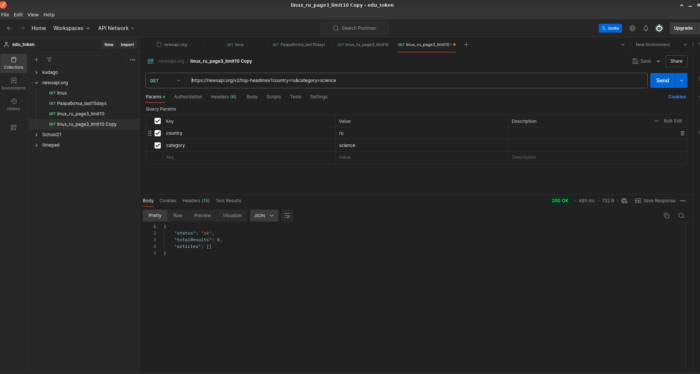

# Part1. News API

## Регистрация и получение токена

1. Для начала тебе необходимо перейти [по cсылке](https://newsapi.org/) и получить **API KEY** (Ключ интерфейса прикладного программирования — это уникальный идентификатор, используемый для аутентификации пользователя, разработчика или вызывающей программы.).

2. Проходим регистрацию

3. Получаем токен и сохраняем в файл или в переменную в Postman

Наш токен: `4a0...48`

## Работа с Postman

1. Перейдем в Postman и создадим коллекцию

2. На вкладке `Variables` создадим новую переменную и сохраним в нее наш токен, назовем ее `newsapiToekn`

3. Перейдем во вкладку `Authorization` и добавим заголовок авторизации типа `Baerer`

4. Теперь мы можем добавить нашу переменную

После чего нажимаем сохранить изменения

Наша коллекция готова к созданию запросов.

### Создание запросов и получение резульатов

Задание:

- Необходимо получить все новости по теме linux.
- Получить все новости по теме «Разработка» на русском языке за последние 15 дней.
- Получить все новости по теме linux на русском языке на 3 странице, на каждой из которых по 10 новостей.
- Получить все заголовки новостей для страны Россия по теме «наука» (science).

Для начала найдем в документации API-endpoint для запросов

Для получения всех новостей по телеме `linux` отправим `GET` запрос с параметром `q=linux` на эндпоинт `https://newsapi.org/v2/everything`

Результат выполнения запроса:

Получить все новости по теме «Разработка» на русском языке за последние 15 дней.

Получить все новости по теме linux на русском языке на 3 странице, на каждой из которых по 10 новостей.

Получить все заголовки новостей для страны Россия по теме «наука» (science).

Для этого запроса используется уже другой эндпоинт - `https://newsapi.org/v2/top-headlines`

Для country=us

Для country=ru

Вся коллекция запросов экспортирована в файл `newsapi.org.postman_collection.json`

