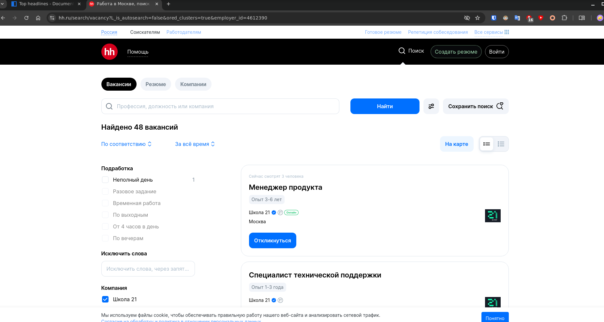
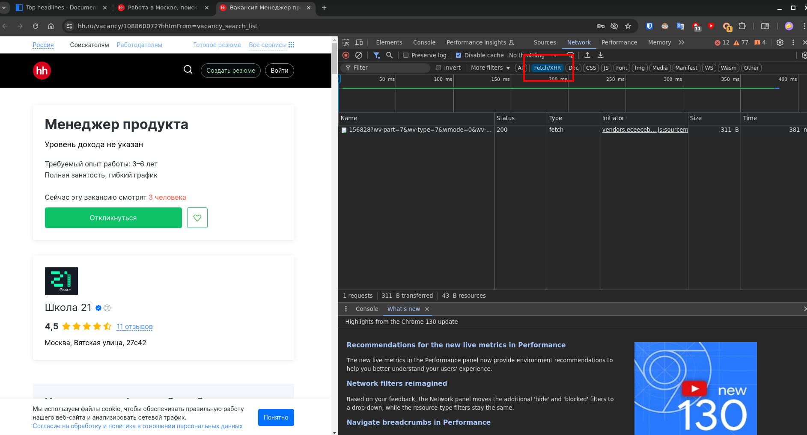
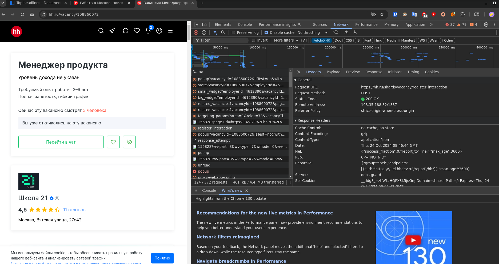
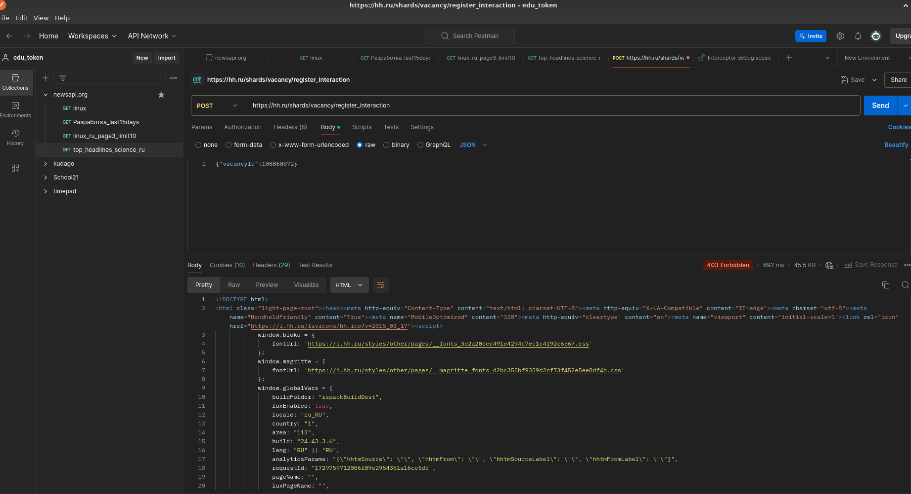

# Part2. Инструменты разработчика

> А сейчас мы с тобой полезем на сайт hh.ru для того, чтобы достать данные с их API (не с сайта). Для этого тебе необходимо открыть консоль разработчика, выбрать вкладку «network» (Сеть), указать фильтр на Fetch/XHR, и выполнять рандомные действия на сайте. Необходимо получить контакты какой-либо вакансии (ищи кнопку «показать контакты» и жми!). В результате прокликивания разных кнопок и ссылок, в разделе network ты увидишь запросы, которые посылаются на API hh.ru (В uri запроса не обязательно должен присутствовать тег «api»). Выполни этот же запрос в postman и убедись, что полученные тобой данные «где-то» присутствуют на сайте. Таким образом, мы с тобой посмотрим на то, как в действительности работают web-приложения, и на то, как они коммуницируют. (Причём открытой, доступной для всех спецификации этого API попросту нет).
Полученный в результате запрос должен начинаться с https://hh.ru/vacancy/...

Переходим в первую попавшуюся вакансию и нажимаем консоль разработчика `F12`

Кликаем на кнопку "откликнуться"

Повторим тоже самое но только в Postman

Результат в постмане выдал 403 - не авторизован. Это значит что браузер получил токен и сохранил его в кукифайлах, а постман попытался получить данные без токена.

