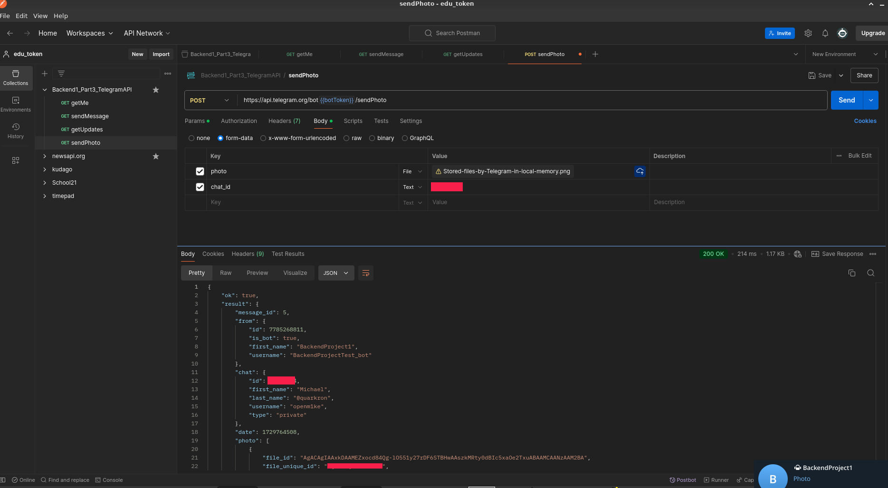
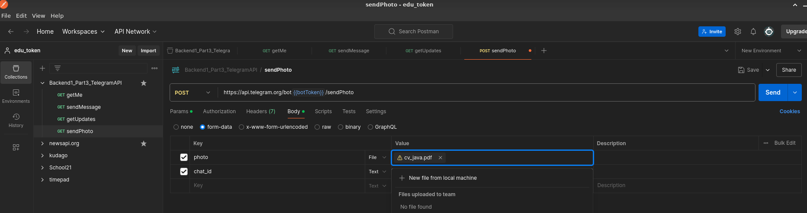

# Part3. Телеграм-бот

> Известное нынче средство автоматизации бизнеса — хороший сайт телеграм-бот! Сделать его сейчас проще простого, особенно благодаря официальной документации.
Написание собственных ботов доступно благодаря открытому Telegram API. Именно потому, что оно открытое, существуют десятки библиотек, которые по-своему реализуют доступные функции бота.
Мы своего бота писать не будем, но... Подёргаем его за «ниточки», предоставленные нам официальным API. В этом задании ты потренируешься делать запросы через Postman к апишке и будешь сразу видеть результаты! А ещё ты увидишь, как просто реализовать свою библиотеку для работы с телеграм-ботами.
Итак, задание.

Создай своего бота. Это делается абсолютно бесплатно через BotFather. Не забудь сохранить токен!
Изучи, в каком формате посылаются запросы к боту через api.telegram.org.
Создай коллекцию в Postman. Последующие запросы добавляй в неё.
Получи информацию о боте (метод getMe).
Отправь сообщение боту (например, просто /start).
Ищи информацию о себе в ответе на метод getUpdates! Сохрани свой user_id и chat_id.
А теперь отправь себе сообщение от имени бота (sendMessage).
Так-так. Теперь можно отправить фотографию себе от имени бота. Потренируйся прикреплять файлы к запросу (в разделе Body через form-data).
А что, если теперь в том же методе sendPhoto вместо фотографии прикрепить pdf-документ? Результат точно удивит!
Теперь вместо pdf-документа попробуй прикрепить docx-файл. Какой будет ответ?
Напоследок посмотрим, что бот может узнать о тебе. Например, твои фотографии. Попробуй отправить запрос с методом getUserProfilePhotos.

Результатом задания является коллекция Postman (минимум 7 запросов). Замечание: не забывай о разнице GET и POST запросов!

## Получим токен у BotFather

Токен: `778....hk`

## Теперь создадим коллекцию в Postman

Для удобства сохраним токен в переменную `botToken`

Найдем эндпоинт для запроса

Из документации становится ясно что запросы возможно посылать как `GET` так и `POST` на эндпоинт `https://api.telegram.org/bot<token>/METHOD_NAME`

`GET`

`POST`

> Отправь сообщение боту (например, просто /start).

Если мы попытаемся через апи отправить сообщение от имени бота то получим ошибку, т.к. у нас не открыт диалог с ботом - в целях защиты от спама бот не может сам открывать диалог поэтому получаем ошибку

Для того чтобы отправить сообщение боту, необходимо создать с ним чат, для этого в клиенте откроем диалог с нашим ботом @BackendProjectTest_bot и нажмем кнопку "старт"

Теперь повтороим запрос в postman

Мы получили сообщение от бота в нашем чате.

> Ищи информацию о себе в ответе на метод getUpdates! 

Сохраним свой user_id и chat_id.

`user_id` нашего бота `7...1` 
`chat_id` того кто открыл диалог с ботом `...`

Сам метод `getUpdates` позволяет получить обновления с сервера телеграм (служебные сообщения итд)

Существует два способа получения обновлений, с помощью `getUpdates` - этим способом мы сами делаем запрос и получаем объекты с данными. Второй способ `WebHook` - в этом случае телеграм сам уведомляет наш сервис о том что есть новые данные.

> Так-так. Теперь можно отправить фотографию себе от имени бота. Потренируйся прикреплять файлы к запросу (в разделе Body через form-data).

Найдем эндпоинт для отправки фото

Фото можно отправить в виде ссылки с внешнего ресурса

А теперь отправить через `Body` сформировав `form-data`

> А что, если теперь в том же методе sendPhoto вместо фотографии прикрепить pdf-документ? Результат точно удивит!

Прикрепим pdf файл и посмотрим результат

Наш пдф был преобразован в изображение

> Теперь вместо pdf-документа попробуй прикрепить docx-файл. Какой будет ответ?

При добавлении docx документа

получаем ошибку `IMAGE_PROCESS_FAILED`

> Напоследок посмотрим, что бот может узнать о тебе. Например, твои фотографии. Попробуй отправить запрос с методом getUserProfilePhotos.

Если у бота нет открытого диалога с пользователем то будет ошибка `"Bad Request: user not found"`

Еще для примера сделаем запрос на закрепление сообщения в диалоге

Благодаря знаниям работы апи телеграм и исследованию школьной платформы я написал бота поиска пиров

@School21Meet_bot - подробнее https://github.com/openm1ke/s21meet_help

Спасибо за внимание!

